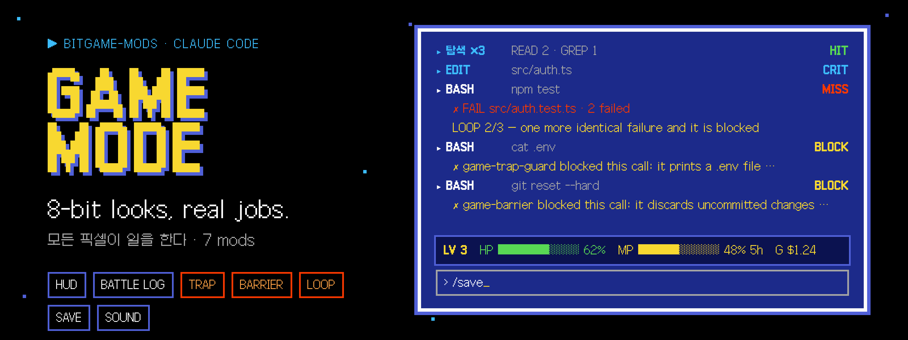
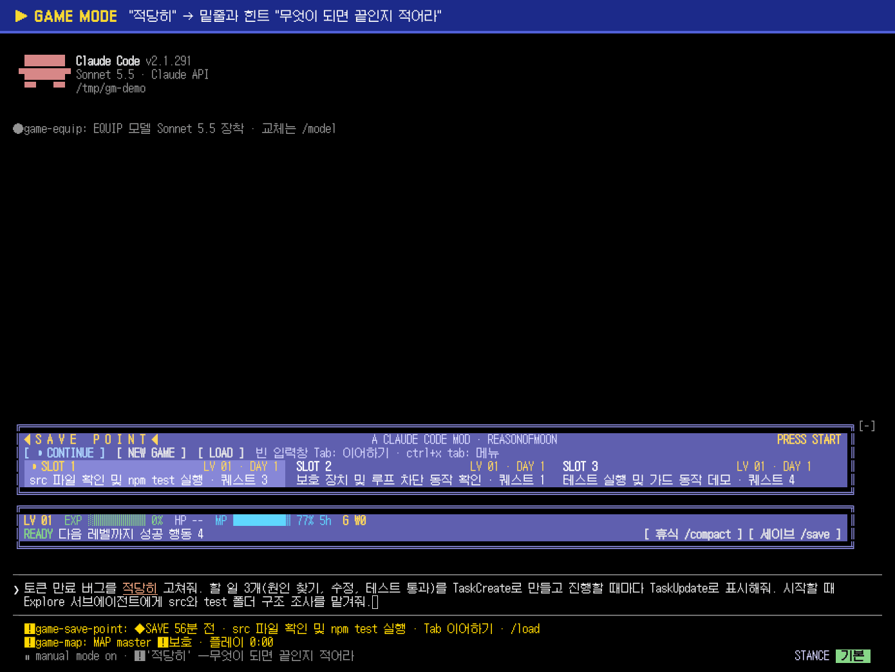
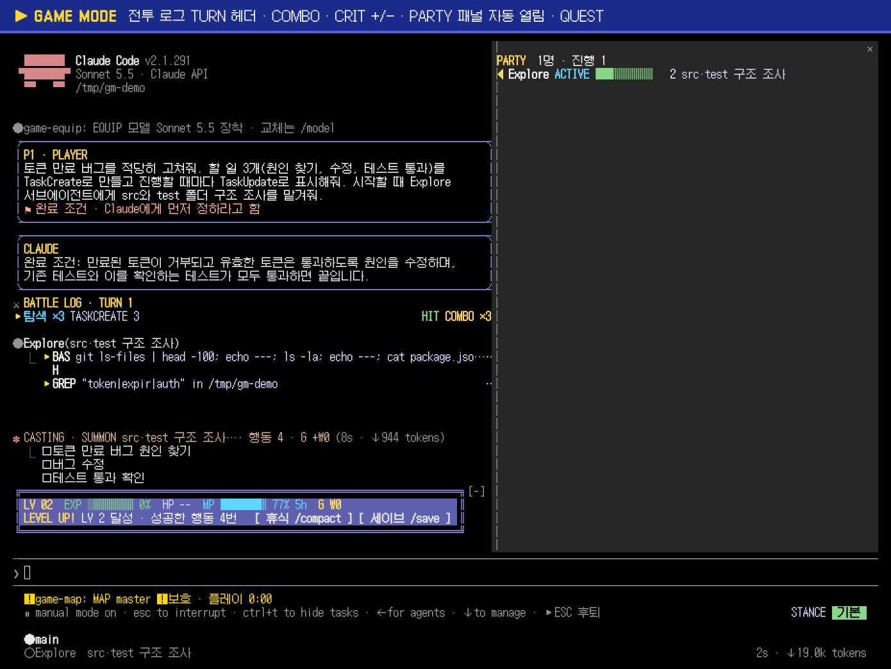
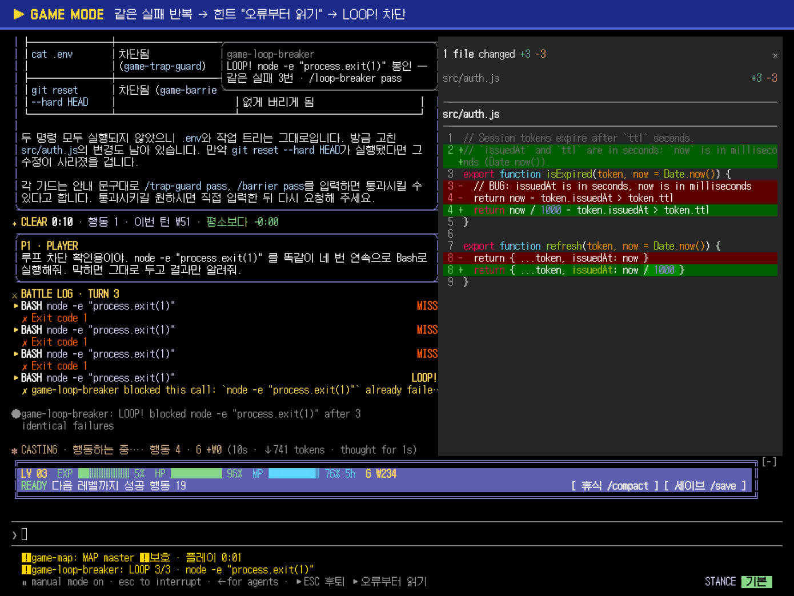
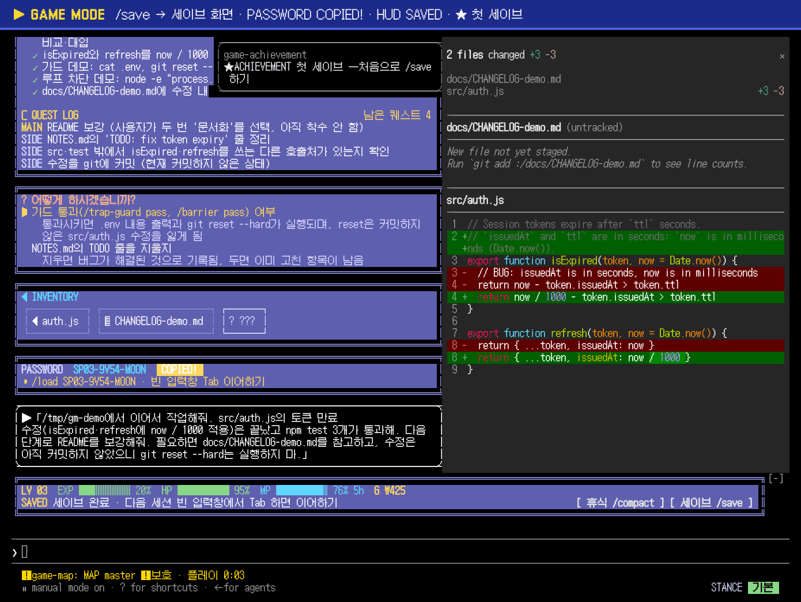
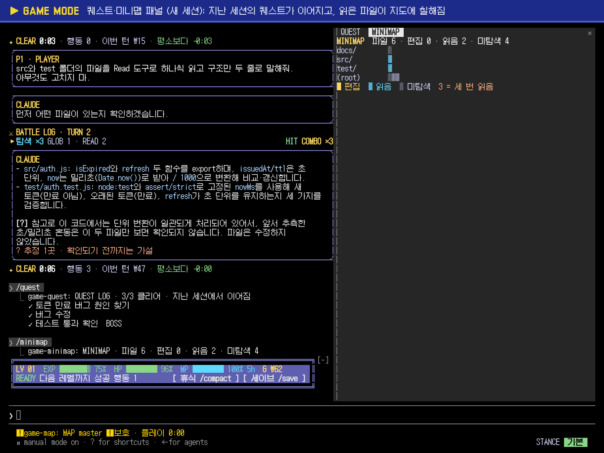
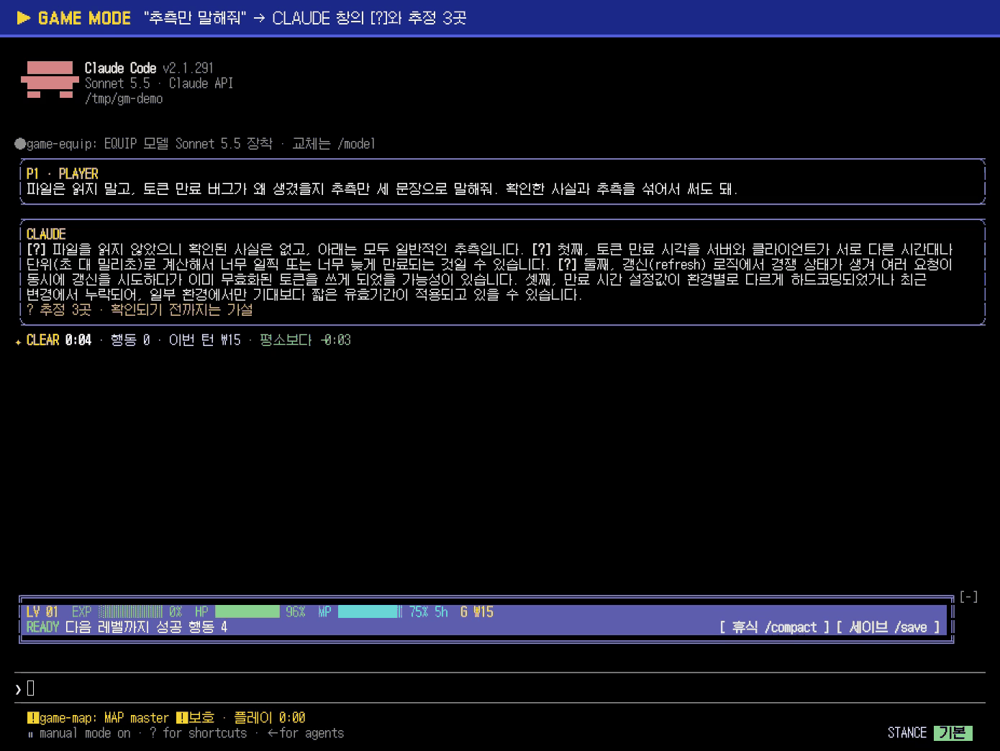

<p align="center">
  
</p>

<p align="center">
  <a href="#start-in-30-seconds"><strong>▶ Start in 30 seconds</strong></a>
  &nbsp;·&nbsp;
  <a href="#see-it-fire"><strong>See it fire</strong></a>
  &nbsp;·&nbsp;
  <a href="#the-22-mods"><strong>The 22 mods</strong></a>
  &nbsp;·&nbsp;
  <a href="#settings"><strong>Settings</strong></a>
  &nbsp;·&nbsp;
  <a href="docs/ROADMAP.md"><strong>Roadmap</strong></a>
  &nbsp;·&nbsp;
  <a href="#한국어-요약"><strong>한국어</strong></a>
</p>

<p align="center">
  
  
  
  <a href="https://github.com/Reasonofmoon/bitgame-mods/actions/workflows/check.yml"></a>
</p>

---

## 8-bit looks, real jobs

**bitgame-mods** is a Claude Code plugin marketplace of **mods**: small hooks modules that run inside the Claude Code engine. Together they are **GAME MODE**: Claude Code dressed as an 8-bit game, where each game element sits where it does work.

> A HUD that is only decoration is noise.  
> **Here HP is your context, MP your plan usage, G your bill — and the traps actually stop things.**

---

## Kernel (one rule · 22 mods)

| You see | Mod | What it does |
|---------|-----|--------------|
| `LV 03  EXP █░░  HP ███ 96%  MP ███ 77% 5h  G ₩263` · `READY` · `HP LOW!` · `SAVED` · `LEVEL UP!` | **HUD** | context left, plan usage left and session cost above the prompt; rest (`/compact`) and save (`/save`) buttons |
| `⚔ BATTLE LOG · TURN 2` · `▸ WRITE src/auth.js +4 −4 CRIT COMBO ×3` · `SUMMON` | **Battle log** | failures stand out; edits show their line counts; a run of clean calls is a combo and the failure that ends it says `BREAK` |
| `TRAP!` | **Trap guard** | refuses calls that would leak a secret |
| `BARRIER!` | **Barrier** | refuses calls that cannot be undone |
| `LOOP!` | **Loop breaker** | stops the same failure being retried unchanged |
| `◆ ★ SAVE POINT ★` · `PASSWORD SP01-MCS4-MOON COPIED!` · title screen | **Save point** | `/save` = what was done, what is left, decisions, files, a resume prompt copied to the clipboard; `/load <password>`; the next session opens on a title screen |
| ♪ | **Earcons** | a sound when a prompt or question waits on you, a long turn ends, a guard refuses, a save is made (macOS, Windows, Linux) |
| `STANCE  자동 승인` | **Stance** | the permission mode as a colored badge at the right of the footer; follows shift+tab |
| `CASTING · BASH npm test… · 행동 3 · G +₩120 (12s · ↓ 300 tokens)` | **Casting** | what the turn is doing now and what it has cost so far |
| `✦ CLEAR 0:42 · 행동 7 · 이번 턴 ₩312 · 평소보다 −0:13` | **Clear time** | each turn against the project's usual turn (median of the last 20) |
| `/party` | **Party** | the session's subagents: `ACTIVE` · `CLEAR` · `FAIL`, their tool calls and jobs |
| `/quest` | **Quest** | the task list as a quest log (`✓` `▶` `·`, the last one the `BOSS`), kept across `/compact` and sessions |
| `/minimap` | **Minimap** | the project's files: edited, read, unexplored, and which ones Claude keeps re-reading |
| `▸ ESC 후퇴` · `▸ /compact 휴식` · `▸ 오류부터 읽기` · `▸ /save 세이브` | **Hint** | what to press now, on the hint line |
| `MAP master ⚠ 보호 · 플레이 1:05` | **Map** | the branch (protected ones marked) and the play time |
| `적당히` underlined · `⚠ '적당히' — 무엇이 되면 끝인지 적어라` · `P1 · moon` | **Spell check** | vague words and secrets marked while you type; a vague prompt asks Claude for a done condition first |
| `★ 지난번 선택` | **Answer memory** | the option you chose last time, when Claude asks the same question again |
| `CLAUDE` window · `**[?]**` · `? 추정 2곳 · 확인되기 전까지는 가설` | **Hedge mark** | sentences that guess are marked, so checked facts and guesses read apart |
| `✦ ITEM GET! docs/auth-notes.md · 새 파일 23줄` · `/inventory` | **Item get** | new files stand out; the files made and changed this session as items |
| `EQUIP 모델 Sonnet 5.5 장착 · 교체는 /model` | **Equip** | which model is on, at the start and whenever it changes |
| `★ ACHIEVEMENT 역전승` · `/achievements` | **Achievement** | first save, 10 safe commits, a comeback, a 10-call combo, a rest before HP 10% |
| `다음 할 일 결정` · `Q1. … [관련 파일만] [전체]` · Tab | **Choice** | the `[상태 요약]` resume prompt as the prompt box's suggestion; its decisions as buttons that refine it (Jev-ranked, odds hidden in shadow mode); skill suggestions while typing |

---

<a id="see-it-fire"></a>

## See it fire

The 21 mods of 0.2.0 in recorded Claude Code 2.1.291 sessions (terminal, 150 × 46, 2 min 49 s): [`docs/assets/game-mode-0.2.0.mp4`](docs/assets/game-mode-0.2.0.mp4).

| | |
|---|---|
|  |  |
| **Start:** title screen, HUD, EQUIP, MAP, STANCE; `적당히` underlined, the hint asks for a done condition | **Turn 1:** `P1` window, Claude states the done condition, `TURN 1`, `COMBO`, `CASTING`, the party pane opens |
|  |  |
| **Guards:** `TRAP!` `BARRIER!` `COMBO ×14 → BREAK`, then `LOOP!`; the hint says `오류부터 읽기` | **`/save`:** the board, `PASSWORD … COPIED!`, `★ ACHIEVEMENT 첫 세이브`, `SAVED` |
|  |  |
| **Next session:** the quest log carried over, the minimap after two reads | **Guesses:** `[?]` on each guessing sentence, `? 추정 3곳` |

What Claude receives when a guard refuses (from the same kind of run, 0.1.1):

```text
game-trap-guard blocked this call: it prints a .env file into the conversation (.env). Keep secrets out of commands, files and the conversation: …
game-barrier blocked this call: it discards uncommitted changes (git reset --hard). This cannot be undone from here. Find a reversible way …
game-loop-breaker blocked this call: `ls /nonexistent-dir-xyz` already failed the same way 3 times in a row (…). Running it again unchanged will not help. …
```

Full log of the guards and `/save`: [`examples/RUN-2026-10-06.md`](examples/RUN-2026-10-06.md).

---

<a id="start-in-30-seconds"></a>

## Start in 30 seconds

macOS, Linux, Git Bash:

```bash
claude plugin marketplace add Reasonofmoon/bitgame-mods
for m in hud battle-log trap-guard barrier loop-breaker save-point earcons \
         stance casting clear-time party quest minimap hint map \
         spell-check answer-memory hedge-mark item-get equip achievement choice; do
  claude plugin install "game-$m@bitgame-mods"
done
```

Windows PowerShell:

```powershell
claude plugin marketplace add Reasonofmoon/bitgame-mods
"hud","battle-log","trap-guard","barrier","loop-breaker","save-point","earcons",
"stance","casting","clear-time","party","quest","minimap","hint","map",
"spell-check","answer-memory","hedge-mark","item-get","equip","achievement","choice" |
  ForEach-Object { claude plugin install "game-$_@bitgame-mods" }
```

Each mod works alone; install only the ones you want. Already on 0.1.x: `claude plugin marketplace update bitgame-mods`, then `claude plugin update game-<mod>@bitgame-mods` for the seven you have and install the new ones; restart Claude Code.

Try one without installing: `claude --plugin-dir ./plugins/game-trap-guard`.

Requires **Claude Code 2.1.287 or later** (mods). Built and tested on 2.1.291. Coding agents: read [AGENTS.md](AGENTS.md) first.

---

<a id="the-22-mods"></a>

## The 22 mods

| # | Mod | Hooks | Commands |
|---|-----|-------|----------|
| 01 | [**game-hud**](plugins/game-hud) | `AbovePrompt` · `session.measure` · `tool.call` · `session.compact` · `session.append` | `/hud` · `hide` · `show` |
| 02 | [**game-battle-log**](plugins/game-battle-log) | `ToolUse` · `ToolResult` · `ToolGroup` · `ToolProgress` · `session.append` · `tool.call` | `/battle-log on` · `off` |
| 03 | [**game-trap-guard**](plugins/game-trap-guard) | `tool.call` (refuses) | `/trap-guard` · `block` · `warn` · `off` · `pass` |
| 04 | [**game-barrier**](plugins/game-barrier) | `tool.call` (refuses) | `/barrier` · `block` · `warn` · `off` · `pass` |
| 05 | [**game-loop-breaker**](plugins/game-loop-breaker) | `tool.call` · `prompt.submit` | `/loop-breaker` · `reset` · `block` · `warn` · `off` · `pass` |
| 06 | [**game-save-point**](plugins/game-save-point) | `command.run` · `$.model.fork` · `$.ui.copy` · `prompt.suggest` · `CommandOutput` · `AbovePrompt` · `PromptHint` | `/save [note\|show\|list]` · `/load [n\|password]` |
| 07 | [**game-earcons**](plugins/game-earcons) | `$.audio.play` · `$.process.run` · `tool.check` · `session.append` · `turn.complete` | `/earcons` · `test` · `on` · `off` |
| 08 | [**game-stance**](plugins/game-stance) | `SessionMode` · `PromptHint` · `classic.UserPromptSubmit` · `classic.PostToolUse` | — |
| 09 | [**game-casting**](plugins/game-casting) | `Spinner` · `tool.call` · `session.measure` | — |
| 10 | [**game-clear-time**](plugins/game-clear-time) | `TurnDuration` · `turn.complete` · `tool.call` | `/clear-time` |
| 11 | [**game-party**](plugins/game-party) | `Pane` · `agent.spawn` · `tool.call` · `turn.complete` | `/party` |
| 12 | [**game-quest**](plugins/game-quest) | `Pane` · `tool.call` (TodoWrite, TaskCreate, TaskUpdate) | `/quest [clear]` |
| 13 | [**game-minimap**](plugins/game-minimap) | `Pane` · `tool.call` · `$.process.run` (git ls-files) | `/minimap` |
| 14 | [**game-hint**](plugins/game-hint) | `PromptHint` · `session.measure` · `tool.call` · `session.append` | — |
| 15 | [**game-map**](plugins/game-map) | `$.ui.status` · `$.process.run` (git) · `$.clock.every` | `/map` |
| 16 | [**game-spell-check**](plugins/game-spell-check) | `prompt.edit` · `prompt.submit` · `PromptHint` · `UserMessage` | — |
| 17 | [**game-answer-memory**](plugins/game-answer-memory) | `AskUserQuestion` · `tool.call` | — |
| 18 | [**game-hedge-mark**](plugins/game-hedge-mark) | `AssistantMessage` | — |
| 19 | [**game-item-get**](plugins/game-item-get) | `ToolResult` · `CommandOutput` · `tool.call` | `/inventory` |
| 20 | [**game-equip**](plugins/game-equip) | `InfoNotice` · `$.ui.log` · `turn.start` · `classic.PostModelSwitch` | — |
| 21 | [**game-achievement**](plugins/game-achievement) | `tool.call` · `session.append` · `session.compact` · `CommandOutput` | `/achievements` |
| 22 | [**game-choice**](plugins/game-choice) | `turn.complete` · `prompt.suggest` · `prompt.edit` · `prompt.submit` · `AbovePrompt` · `$.http.fetch` (Jev) · `$.model.fork` | `/choice` |

What each guard refuses, in one line each (details in each README):

- **Trap guard**: literal keys in commands, URLs or source files (an `.env` file may hold them); `cat .env`, `grep KEY .env`, `echo $API_KEY`, a bare `printenv`; reading `.env`, `id_rsa`, `*.pem`, `~/.aws/credentials`.
- **Barrier**: force-push or delete `main`/`master`/`prod`/`release`; `reset --hard`, `clean -f`, `checkout .`, `restore .`, `stash clear`, `branch -D`; `rm -r` on `/`, `~`, the project root or outside the project; `npm publish`, `cargo publish`, `gh release create`, `docker push`; `terraform destroy`, `kubectl delete`; `DROP TABLE` through a database client; `mkfs`, `dd of=/dev/…`; edits outside the project (links resolved).
- **Loop breaker**: the 4th run of a call that failed the same way 3 times in a row with nothing changed in between (timings ignored, counts kept).

---

<a id="settings"></a>

## Settings

Change any of these with `/plugin configure <mod>@bitgame-mods`.

| Setting | Mods | Default | Values |
|---------|------|---------|--------|
| `intensity` | every mod but the three guards | `casual` | `off` · `casual` · `hardcore` (each README says what `hardcore` adds) |
| `palette` | every mod that draws | `nes` | `nes` · `gameboy` · `amber` (dark terminals) · `theme` (follows your Claude Code theme; use it on a light background) |
| `currency` · `krwPerUsd` | HUD, casting, clear time | `krw` · `1400` | `krw` · `usd` |
| `mode` | trap guard, barrier, loop breaker | `block` | `block` · `warn` · `off` |
| `lowHp` | HUD, hint | `25` | percent of context left that counts as low |
| `autoOpen` | party | `true` | open the pane when the first subagent starts (144 columns and up) |
| `protectedBranches` | map | `main,master,production,release/*` | names or patterns marked `⚠ 보호` |
| `player` | spell check | your login name | the name in `P1 · <name>` |
| `shadowMode` | choice | `true` | hide Jev's odds and order on the decision buttons; record what an auto-approver would have picked |
| `skillSuggest` · `skillThreshold` | choice | `true` · `50` | send drafts to Jev for skill suggestions; the probability (%) a skill needs to show |

- **`pass`** lets the next refused call run once (within 10 minutes). `pass`, `warn` and `off` are accepted only when **you** type them, so Claude cannot lift a guard by running the command itself.
- **Pixel font:** in a terminal the look comes from your terminal's font. Set it to **Galmuri Mono 11** ([quiple/galmuri](https://github.com/quiple/galmuri), OFL) and the whole screen matches.

---

## Together

The HUD's `세이브` button runs `/save`; the battle log names each guard's refusal; earcons plays `block` and `save`; the hint line and the HUD both read the context left; the save point's `Tab 이어하기` and the hint mod's `▸ /save 세이브` share the hint line. The links are plain text (`game-<mod> blocked this call:`, `◆ SAVE POINT ·`) or the engine's own events, so any subset works and nothing breaks when one is missing.

---

## Why this wins (falsifiable)

| | Plain Claude Code | Settings hooks (scripts) | **bitgame-mods** |
|--|--|--|--|
| Context, plan usage and cost in view | `/context`, `/cost` on demand | status line script | **always above the prompt, with a low-HP action** |
| A secret about to be printed or written | permission prompt, if asked | if you write it | **refused before it runs, with what to do instead** |
| `git reset --hard` / force-push to main | permission prompt, if asked | if you write it | **refused; one-time `pass` only you can type** |
| The same failing command, fourth time | runs | rarely | **refused until something changes** |
| "Fix it properly" with no finish line | Claude guesses | — | **Claude states the done condition first** |
| A guess written as a fact | reads like the rest | — | **marked `[?]` and counted** |
| Resume tomorrow | `--continue`, then explain again | — | **title screen; Tab, or `/load <password>`** |
| Tests you can run | — | rarely | **173 tests, `claude plugin test`** |

If a guard refuses an ordinary command, or misses a case its README lists, it is wrong: [open an issue](https://github.com/Reasonofmoon/bitgame-mods/issues) with the command.

---

## Known limits

- **The permission prompt cannot be changed by a mod.** Earcons plays `ask` when one opens instead.
- **Guards read text, not intent.** A script that runs `npm publish` inside (`./deploy.sh`) is not opened; an unusual key format passes.
- **Polling looks like a loop.** `curl localhost:3000` failing the same way while a server boots will be sealed at the 4th try; wrap the wait in one command or use `warn`.
- **Stance between prompts is inferred.** No event reports a shift+tab, so the badge follows the footer and shift+tab's order; the next prompt or tool result confirms the mode exactly.
- **Equip:** in a session with an API key the engine shows no model notice under the logo, so the equip line is a transcript row of its own.
- **Answer memory** can only mark an option (in its description); the dialog itself is the engine's.
- **Sound:** Windows plays through PowerShell's `SoundPlayer` (first cue about a second late while PowerShell starts); Linux needs `paplay` (PulseAudio or PipeWire) or `aplay`.
- **Windows**: paths are compared without regard to case or slash direction (`C:\`, `c:/`, Git Bash `/c/`); tests cover them.
- **Headless runs** (`claude -p`) draw nothing; the guards still refuse.
- **Choice** reads only the `[상태 요약]` format (its README shows it). Jev ranking and skill suggestions need `TYPESAFE_API_KEY` and send the summary, or the draft you are typing, to typesafe.ai; set `skillSuggest` off for private work. Without a key the buttons keep Claude's order.

---

## Layout

```
.claude-plugin/marketplace.json   the catalog `claude plugin marketplace add` reads
plugins/game-*/                   one plugin each: plugin.json · hooks/ · types/ · tests/ · README
plugins/game-*/hooks/palette.ts   the shared look, one copy per plugin (scripts/check.sh keeps them equal)
plugins/game-earcons/sounds/      the 8-bit WAV cues (scripts/make-earcons.py writes them)
examples/RUN-2026-10-06.md        real-run log of the guards and /save
docs/                             GOALS (0.2.0 acceptance) · ROADMAP · screenshots · hero image
scripts/check.sh                  strict validate + tests for every plugin (CI runs this)
```

Zero runtime dependencies. The hooks modules run inside Claude Code's own mod environment: no Node, no build step.

---

## 한국어 요약

**GAME MODE**는 Claude Code를 8비트 게임 화면처럼 꾸미되, **모든 요소가 실제 일을 하도록** 만든 Mod 22종입니다. 원하는 것만 골라 설치해도 됩니다.

- **안전과 비용 (P1)**: HUD(HP=남은 컨텍스트, MP=요금제 한도, G=비용 ₩), 전투 로그(TURN·COMBO·BREAK·+/− 줄 수·가드별 판정), 트랩 가드(비밀키 노출 차단), 결계(되돌릴 수 없는 명령 차단), 루프 차단, 세이브 포인트(세이브 화면·PASSWORD·타이틀 화면·`/load`), 효과음(macOS·Windows·Linux)
- **흐름 파악 (P2)**: STANCE(권한 모드 배지), CASTING(지금 하는 일과 이번 턴 비용), CLEAR(평소 대비 턴 시간), PARTY·QUEST·MINIMAP 패널, 힌트 줄, MAP(브랜치와 플레이 시간)
- **습관 (P3)**: 스펠 체크(모호어 밑줄, 완료 조건 먼저 요청, `P1` 메시지 창), 지난번 선택 ★, 추정 문장 `[?]` 표시, ITEM GET!·`/inventory`, EQUIP(모델), 업적
- **이어 하기 (P4)**: CHOICE — 답변 끝 `[상태 요약]`의 재개 프롬프트를 입력창 제안(Tab)으로, 결정 항목을 버튼으로 띄우고 고른 대로 프롬프트를 다듬음. Jev(typesafe.ai)가 뒤에서 순위를 매기며 섀도 모드(기본)에서는 확률을 숨기고 기록만 함. 입력 중 맞는 스킬 제안

설치는 위 [Start in 30 seconds](#start-in-30-seconds)의 명령 한 번이면 됩니다. Windows는 PowerShell 블록을 쓰세요.
