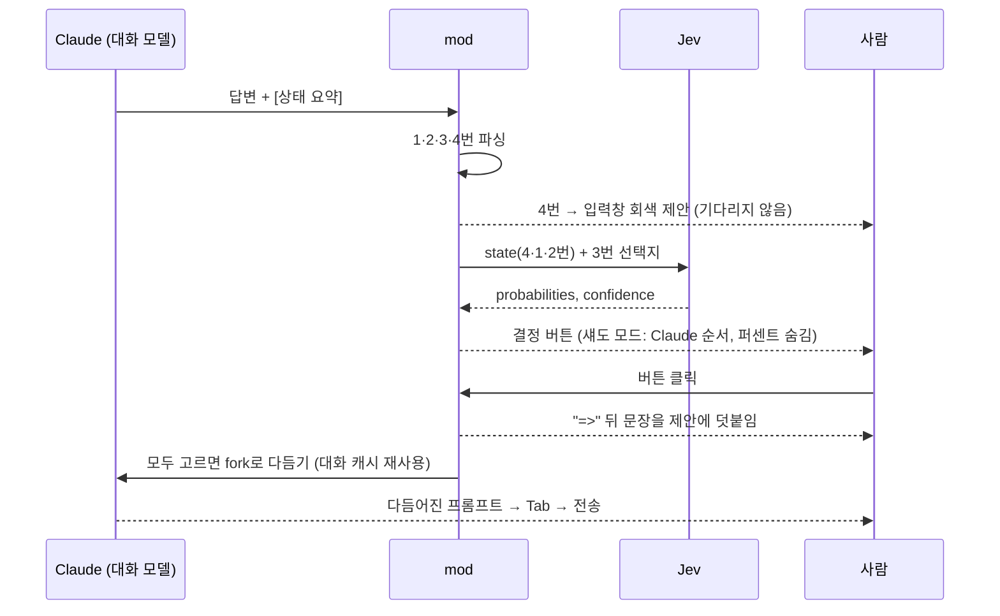

# 프롬프트 업그레이드의 원리 — Claude는 쓰고, Jev는 고른다

> 상태: 실사용 검증 중(섀도 모드). 이 문서는 `game-choice` mod(개발명 `resume-suggest`)가
> 다음 프롬프트를 만들고 다듬는 방식을 설명한다. 팩 등록 전이며, 수치는 2026-10-10 기준이다.

## 한 줄 요약

답변 끝의 **상태 요약**이 다음 프롬프트의 재료가 된다. 4번(이어서 할 프롬프트)은 입력창의
회색 제안이 되고, 3번(결정할 것)은 버튼이 된다. 버튼의 순서와 확률은 결정 전용 모델 **Jev**가 매기고,
사람이 고르면 그 선택이 프롬프트에 붙은 뒤 **Claude**가 대화 맥락을 알고 한 단락으로 다듬는다.

| 누가 | 하는 일 | 하지 않는 일 |
|---|---|---|
| Claude (대화 모델) | 상태 요약을 쓰고, 고른 결정을 녹여 프롬프트를 다듬는다 | 확률을 적지 않는다 |
| Jev (TypeSafe System One) | 정해진 선택지에 옵션별 확률·확신도를 매긴다 (수백 ms) | 글을 쓰지 않는다 |
| mod | 답변 끝을 가로채 요약을 읽고, Jev를 부르고, 버튼과 회색 제안을 그린다 | 자동으로 보내지 않는다 (아직) |

## 흐름



## 상태 요약 형식 (전역 CLAUDE.md 규칙)

```
3. 내가 결정해야 할 것:
   - Q: 결정할 질문 한 줄
     - 추천 옵션 => 고르면 4번 프롬프트 끝에 붙일 지시 한 문장
     - 다른 옵션 => 붙일 지시 한 문장
4. 다음에 이어서 할 때 붙여넣을 프롬프트:
   - 줄바꿈 없는 한 단락, 새 세션에서 그대로 동작하는 self-contained 텍스트
```

- 가장 권하는 옵션을 맨 앞에 둔다. 확률은 Claude가 적지 않는다 (Jev가 매긴다).
- `=>` 뒤 문장은 4번 끝에 그대로 붙여도 말이 되는 명령문이어야 한다. 그래야 "고르기 = 프롬프트 완성"이 된다.

## Jev에게 보내는 것과 받는 것

```
POST https://api.typesafe.ai/v1/systemone      Authorization: Bearer $TYPESAFE_API_KEY
{
  "model": "jev-latest",
  "state": "Work to resume: …\nDone so far:\n- …\nStill to do:\n- …",
  "questions": { "d0": { "type": "choice", "instructions": "… 질문",
                         "criteria": { "A": "옵션 — 지시", "B": "옵션 — 지시" } } }
}
→ { "answers": { "d0": { "choice": "A", "confidence": 0.98, "probabilities": { "A": 0.99, "B": 0.01 } } } }
```

- 판단 재료(`state`)는 4번 + 1번(한 일) + 2번(남은 일), 3,000자 이내. 처음 4번만 보냈을 때는
  100%/0% 같은 극단값이 잦았고, 1·2번을 넣은 뒤 64%/36%처럼 망설이는 질문이 구분되기 시작했다.
- 실제 호출: 231–395ms, 결정 1개에 입력 약 450토큰.

## 입력 중 스킬 제안

입력이 0.8초 멈추면 초안을 보유 스킬(슬래시 명령)과 Jev Choice로 맞춘다. Choice는 선택지 255개가 상한이라
초안과 단어가 겹치는 순으로 254개를 추리고 `none`을 더한다. 확률 50% 이상이면 띠에 `/스킬 82%`를 띄우고,
[적용](초안 앞에 `/스킬`)과 [맞춤 다듬기](Claude가 그 스킬용 프롬프트로 재작성)를 준다.

## 실패해도 멈추지 않게

| 상황 | 띠 문구 | 버튼 |
|---|---|---|
| 정상 | Jev 확률순 (섀도 모드: "Jev 순위 숨김") | Jev 순 / Claude 순 |
| 키 없음 | Claude 추천순 (TYPESAFE_API_KEY 없음) | Claude 순 |
| HTTP 오류 | Claude 추천순 (HTTP 401 등) | Claude 순 |
| 8초 무응답 | Claude 추천순 (Jev 응답 시간 초과) | Claude 순 |

**교착의 교훈.** 첫 버전은 턴 끝 훅에서 회색 제안 표시를 `await`했다. 엔진은 턴이 도는 동안 제안을 띄우지 않고,
그 훅은 아직 턴의 일부라 서로를 기다렸다. Jev 요청이 한 번도 나가지 않았다. 지금은 제안을 던져 두고(`void`)
Jev를 바로 부른다. 회귀 테스트가 옛 코드에서는 시간 초과로 실패한다.

## 자동 승인으로 가는 길 (단계적)

1. **섀도 모드 (지금).** 버튼은 Claude 순서, 퍼센트는 숨긴다. 카드마다 "자동이었다면 무엇을 골랐을지"를 기록한다.
   자동 대상 = 모든 결정의 1순위 확률 ≥ 0.9, 확신도 ≥ 0.8, 카드의 어느 옵션에도 위험 키워드
   (커밋·푸시·머지·배포·삭제·발행·전송·비용·eval·설정) 없음.
2. **자격 (켜기 전 4조건).** 결정 카드 ≥ 30, Jev 1순위 일치율 ≥ 90%, 90–100% 구간 실제 적중 ≥ 90%,
   섀도 적중률 ≥ 90%. 섀도 대상 카드가 10개 미만이면 기준을 낮추지 않고 일주일 연장한다.
3. **실제 자동 승인 (미구현).** 10초 카운트다운과 취소, 연속 3턴 상한, 오류·테스트 실패·결정 없음이면 멈춤.
   자동 선택은 `auto: true`로 기록해 분석에서 뺀다 (Jev가 자기 답으로 채점되는 것을 막는다).

## 지금까지의 근거 (작은 표본, 결론 아님)

| 비교 | 결과 |
|---|---|
| Claude가 맨 앞에 둔 옵션 vs 사람 선택 | 5/7 |
| Jev 1순위 vs 사람 선택 (퍼센트가 보이는 상태) | 7/7 — 둘이 갈린 2건 모두 Jev 쪽 |
| Jev 1순위 vs 사람 선택 (섀도 모드, 퍼센트 숨김) | 1/4 |
| 섀도 대상 카드 적중 | 1/1 |

퍼센트를 보일 때와 숨길 때의 차이(7/7 대 1/4)는 **앵커링** 의심 신호다. Jev의 가치는 "얼마나 맞히나"가 아니라
**기준선(Claude의 첫 옵션)보다 얼마나 더 맞히나**로 판단한다. 분석은
`node analyze-picks.mjs --split <날짜>`로 하며, 날짜 전후의 일치율과 섀도 적중률을 나눠 본다.

## 개인정보와 키

- 결정 질문·상태 요약, 그리고 스킬 제안을 켜면 입력 중인 초안이 typesafe.ai로 전송된다. 스킬 제안은 설정으로 끈다.
- 키는 사용자 환경 변수 `TYPESAFE_API_KEY`에만 둔다. 기록 파일(`last-jev.json`, `picks.json`)에는 키를 남기지 않는다.
- 한 번은 다른 도구 설치 무렵 사용자 환경 변수에서 키가 사라졌다. 띠에 "TYPESAFE_API_KEY 없음"이 보이면 먼저 이것을 확인한다.
